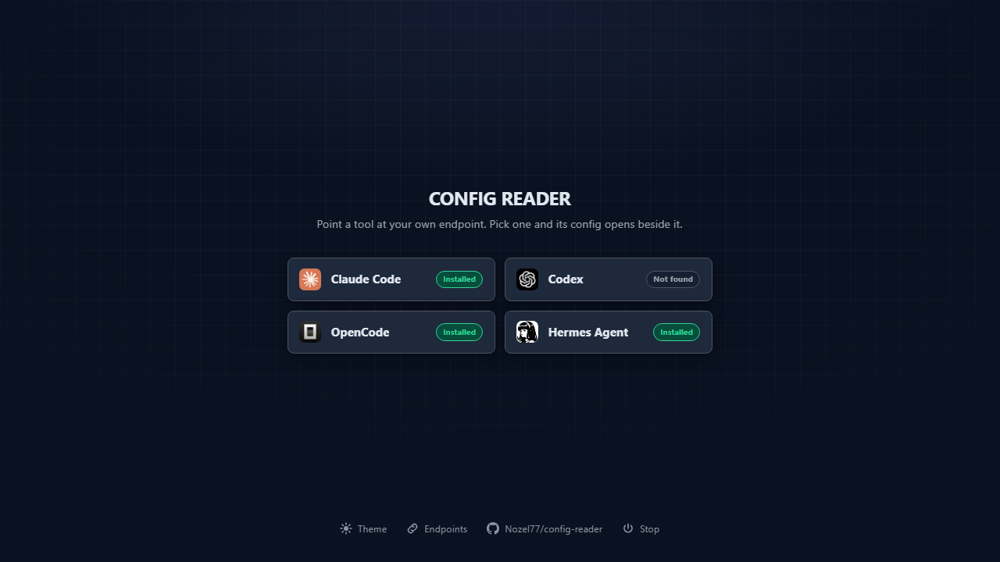
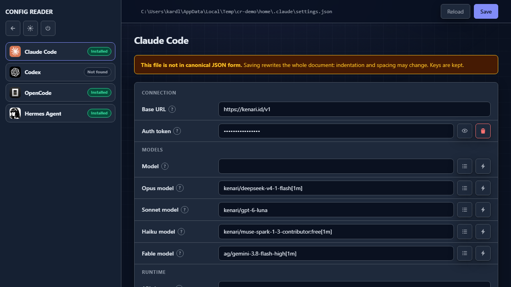
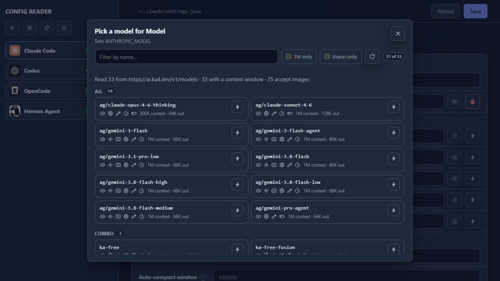
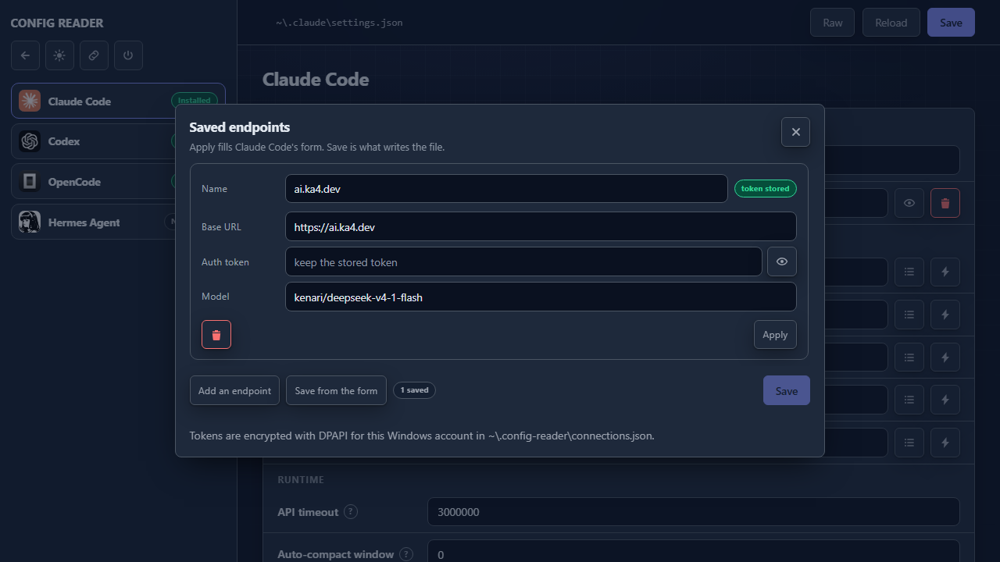

# CONFIG READER

**Point your AI coding tools at any gateway — without hand-editing a config file.**

[](LICENSE) [](#requirements) [](#requirements) [](https://github.com/Nozel77/config-reader/graphs/contributors)

Pick a tool, and its config opens beside the picker. Change the connection values in a form and save; everything else in the file — permissions, hooks, MCP servers, model roles — round-trips untouched.



**Quick nav:** [Quick start](#quick-start) · [Features](#features) · [Supported tools](#supported-tools) · [Saved endpoints](#saved-endpoints) · [Any gateway](#point-it-at-any-gateway) · [CLI](#cli) · [API](#api)

## Why

Every gateway tells you to "set your base URL" and hands you a config file to edit by hand. That file usually holds more than your endpoint — permissions, hooks, MCP servers, model roles — and one malformed comma takes the whole thing down.

This editor reads the file, shows only the values that point at your endpoint, and writes back only those.

## Quick start

```sh
git clone https://github.com/Nozel77/config-reader.git
cd config-reader
node server.js --open
```

No install step. It opens `http://127.0.0.1:8787` and edits `~/.claude/settings.json`.

Then: **pick a tool → edit the connection values → Save.** Reload re-reads the file from disk; the back arrow closes the tool and returns to the picker.

On Windows you can also double-click `start.cmd`. Put a desktop icon there once with `start.cmd --shortcut`.

On macOS, `node server.js --shortcut` writes a double-clickable `CONFIG READER.command` into `~/Applications` — open it from Finder and the editor starts and opens its own tab. No `node server.js` to type again after that.



## Features

- **Tool picker with live status** — the server finds each config file itself rather than trusting a path from the browser. Every card says whether the CLI is actually on your `PATH` (`Installed` / `Not found`), so a config left behind by an uninstalled tool is visible before you touch it.
- **Full `env` editor for Claude Code** — 10 known fields (connection, models, runtime) grouped as cards, plus an "Other variables" section so unknown keys stay visible and survive round-trips.
- **Simple mode for 3 more tools** — the same connection values patched into each tool's native format by text surgery; the rest of the file is never rewritten.
- **Model picker that reads any gateway** — fetches `<base>/v1/models` server-side and lists what the endpoint actually reported. See [Point it at any gateway](#point-it-at-any-gateway).
- **Saved endpoints** — a base URL, auth token and default model kept once and applied to any tool's form. See [Saved endpoints](#saved-endpoints).
- **Safe saves** — atomic write (tmp + rename), 5 rotating backups, a stale-write guard that returns `409` when the file changed under you, per-file EOL preserved, and no-op saves that skip the backup.
- **Dark / light theme** — follows the OS, toggle persisted in `localStorage`, painted before CSS so there is no light flash on load.
- **Localhost-hardened** — binds `127.0.0.1` only, checks `Origin` on every `/api/*` call (reads included — the settings reply carries your token), caps bodies at 5 MB, never logs secrets, never sends the API token to the browser.

## Supported tools

| Tool | Mode | File edited | What gets written |
|------|------|-------------|-------------------|
| Claude Code | `env` | `~/.claude/settings.json` (`$CLAUDE_CONFIG_DIR` wins) | the `env` object only; the rest of the document round-trips untouched |
| Codex | `simple` | `~/.codex/config.toml` (`$CODEX_HOME` wins) | `model`, `model_provider`, `[model_providers.9router]` block |
| OpenCode | `simple` | `~/.config/opencode/opencode.json` | `provider.9router` entry + namespaced `model` |
| Hermes Agent | `simple` | `$HERMES_HOME/config.yaml` + `$HERMES_HOME/.env` | top-level `model:` block, patched key by key; key upserted as `OPENAI_API_KEY` in `.env` |

All non-Claude tools are pointed at the `9router` provider id, so an existing 9Router install is edited in place instead of duplicated.



## Saved endpoints

The same three values — base URL, auth token, default model — get typed into every tool you point at the same gateway. Save them once instead, and fill any tool's form with one click.



**Apply fills the form; Save writes the file.** Apply never touches a config on its own — it puts the values in the editor and marks the form dirty, so the existing Save button stays the only thing that writes a tool's config. That is also why the token can live in the store without a second write path existing.

**Saving the form you already have.** A tool is often configured before you open this dialog — by hand, by another tool, by an earlier session. **Save from the form** reads the open tool's own base URL, token and model into a new row, so an existing setup becomes a saved endpoint in one click instead of three retyped values.

**Where it lives.** `~/.config-reader/connections.json` — under your home directory, so re-cloning the editor does not take the tokens with it.

**How the token is stored.** On Windows it is a DPAPI blob that only your account on that machine can open; copy the file elsewhere and the key refuses to decrypt, and the row says so rather than applying an empty token. On Linux, WSL and macOS there is no OS key store this project can reach without its first dependency, so the token is plain text in a file with mode `600`. Either way the store is one more place a token lives: rotating a token means updating it here too.

**The list reply never carries a token.** `GET /api/connections` returns names, base URLs, models and a `hasKey` flag. The value itself is handed out one row at a time, by name, only when Apply asks for it — so a screenshot or a shared screen of the list shows nothing secret.

## Point it at any gateway

Base URL in, model list out. The picker fetches `<base>/v1/models` server-side and shows what the endpoint actually reported: context window, image input, tool and reasoning support, free tiers, display names.

Nothing is guessed. Gateways spell the same fact differently and some simply don't send it — when a reply carries no context window, the picker shows none instead of inventing one. The note under the search bar counts how many models actually reported a window and image input, so you can see exactly what the endpoint gave you.

## Requirements

- **Node.js 22.13+** — the release where `node:module`'s `stripTypeScriptTypes` actually landed (v22.13.0, and v23.2.0 on the odd line). A bare major check would wave 22.0–22.12 through. The check is by capability, so an older runtime gets a sentence, not a stack trace.
- **No `npm install`. No `package.json`.** Clone and run.
- **Windows, WSL, Linux, or macOS.** The desktop shortcut installer covers all three families: `.lnk` on Windows, `.desktop` on Linux, and a double-clickable `.command` in `~/Applications` on macOS. Paths follow each tool's own rule, so `~` is whatever that platform calls home.

> [!NOTE]
> **WSL and cross-platform paths.** Run inside WSL and the editor edits the Linux-side configs. Run on Windows with a WSL distro installed and you get two separate `~/.claude` directories — the Windows one and the distro's — and no tool can guess which you meant. Point at the other side explicitly with `CLAUDE_CONFIG_DIR` (`/mnt/c/Users/you/.claude` from inside WSL, or `\\wsl.localhost\<distro>\home\you\.claude` from Windows). The same applies to `CODEX_HOME` and `HERMES_HOME`.
>
> Verified on Windows; the POSIX branches (`chmod 600`, the `.desktop`/`.command` installers, `xdg-open`) are covered by the checks and by path-composition tests per platform flavour, not by a run on a Linux host.

## CLI

```
node server.js [--port 8787] [--open] [--selftest] [--shortcut] [--name NAME] [--dir DIR]
```

| Flag | Effect |
|------|--------|
| `--port N` | Listen port (default `8787`). |
| `--open` | If something is already running on that port, just open the browser instead of dying with `EADDRINUSE`. Otherwise start and open. |
| `--selftest` | Run the built-in checks (round-trip, backups, path composition, `/v1/models` URL logic, launcher quoting, simple-mode formats) and exit. |
| `--shortcut` | Write the double-click launcher and exit. `--name` renames it, `--dir` places it anywhere — the public desktop, a USB stick. On macOS that is a `.command` in `~/Applications`; on Linux a `.desktop` in `~/.local/share/applications`; on Windows a desktop `.lnk`. Each launcher spells out the absolute path of the `node` that created it, so a Homebrew/nvm install is found by a Finder double-click even though the GUI PATH would not have it. |

Environment overrides, each following the tool's own rule: `CLAUDE_CONFIG_DIR` for `~/.claude`, `CODEX_HOME` for `~/.codex`, `HERMES_HOME` for `~/.hermes`. Honoured by scan, read, write, and selftest.

## Usage notes

- **Emptying a field deletes the key** from `env`. Unknown keys appear under "Other variables" with add support — nothing is silently dropped.
- **The model picker writes the target you name.** Assign sets whichever variable opened the dialog; a model advertising a ≥1M context window gets the `[1m]` suffix Claude Code expects, and anything else has it stripped.
- **Non-canonical files are announced.** If re-serialising the file would change it (indentation, key order, spacing), the editor says so before you save — a reformat you agreed to, not one you find in `git diff` later.
- **Broken files are a supported state.** Invalid JSON shows the raw text and the parse error instead of crashing, and Save is disabled so the broken file is not overwritten. When the mistake is one the parser's own message cannot name — a `//` comment, a trailing comma, curly quotes — the banner says which it is, because all three come back as the same opaque "Expected double-quoted property name".
- **`settings.json` is strict JSON, and this editor matches Claude Code.** A `//` comment or a trailing comma is a syntax error in that file — Claude Code reports it as a Settings Error at the next start — so the editor refuses it too rather than silently rewriting your file into a form you did not write. `opencode.json` is the exception: that one is JSONC in the wild and trailing commas are tolerated.
- **`model:` block edits are surgical.** Only `default`, `base_url` and (when absent) `provider` are touched. A `context_length`, a `max_tokens`, or an `api_key: ${YOUR_OWN_VAR}` line you wrote by hand survives a save untouched.
- **Simple-mode secrets stay put.** Hermes keeps its key in `.env`, so the form hands that field back empty on load — empty means "leave the stored key alone", not "erase it".
- **Buttons say what they are doing.** Every button that waits on the network (Save, Reload, Load models, the per-model test) disables itself and shows a spinner while the request is in flight, then hands itself back when it settles — including when it fails.
- **Backups:** `<config-dir>/backups/<file>.backup.<timestamp>`, last 5 kept, oldest pruned first. The same scheme sits beside each simple-mode file.
- **Confirmation before anything is lost.** Reload, going back, closing the endpoints dialog with unsaved rows, and stopping the server each ask first, in a dialog that names the action. A refused confirm leaves your draft exactly where it was.

## API

All paths are derived server-side. The browser names a **tool**, never a file.

| Method | Route | Purpose |
|--------|-------|---------|
| `GET` | `/` | `index.html` |
| `GET` | `/app.js` | `app.ts` with types stripped on the fly (cached by mtime) |
| `GET` | `/styles.css` | Stylesheet, read per request — edit and reload, no restart |
| `GET` | `/icon/:id.png` | Per-tool icon; the id is checked against the registry |
| `GET` | `/api/tools` | Tool registry |
| `POST` | `/api/scan` | `{ tool }` → `{ found, file, … }` |
| `GET` | `/api/settings?tool=` | Full document (`env` mode) or `{ values }` (`simple` mode). Defaults to `claude`. |
| `POST` | `/api/settings` | `env`: `{ tool, doc, baseMtimeMs }`. `simple`: `{ tool, values }`. Returns `{ ok, bytes, mtimeMs, backup }`. |
| `POST` | `/api/models` | `{ baseUrl, apiKey }` (unsaved draft) → `{ url, models, caps }` or `{ error }`. Token used server-side only. |
| `POST` | `/api/test-model` | `{ baseUrl, apiKey, model }` → `{ ok, ms, error? }`. One tiny completion — a model can be listed and still be down upstream. |
| `GET` | `/api/connections` | `{ file, exists, atRest, profiles: [{ name, baseUrl, model, hasKey }] }`. Never a token. |
| `POST` | `/api/connections` | `{ profiles }` → `{ ok, count }`. A row with no `apiKey` keeps the stored one, so editing a URL never means retyping the token. `400` on a bad URL, a duplicate name, or more than 50 rows. |
| `POST` | `/api/connections/reveal` | `{ name }` → `{ apiKey }`, or `409` when the blob cannot be opened on this machine. |
| `POST` | `/api/shutdown` | Stop the server. Answered before the exit, so the browser gets the reply. |

Error contract: `400` bad input · `403` bad `Origin` · `409` stale write (the file changed since load — reload, don't force) · `413` body over 5 MB · `502` model-list fetch failed, with the real reason (`ECONNREFUSED`, `ENOTFOUND`, status detail) rather than a bare "fetch failed".

## Project structure

```
server.js             Entry point: version check, CLI flags, server start. Node stdlib only.
lib/
  paths.js            Every filesystem path this project derives, server-side.
  fs-safe.js          Atomic writes, backup rotation, BOM/EOL helpers.
  http.js             send / origin check / body cap, the TS stripper, browser open.
  upstream.js         Base-URL normalisation: /v1, model list, chat URL.
  util.js             num / str — the two scalar coercions shared across modules.
  model-caps.js       Context window, vision, tools, pricing from a /v1/models reply.
  secrets.js          DPAPI at rest on Windows; plain elsewhere.
  connections.js      The saved-endpoint store.
  shortcut.js         Desktop launcher installers for Windows, Linux, macOS — the `.command` is what a Mac double-clicks.
  router.js           All HTTP routes.
  tools/
    index.js          Tool registry (id, mode, bin), path resolution, simple-mode dispatch.
    claude.js         Claude Code env-mode reader.
    codex.js          Codex TOML reader/writer.
    opencode.js       OpenCode JSONC reader/writer.
    hermes.js         Hermes YAML block patcher + .env upsert.
app.ts                Frontend entry: wire-up and boot. Served as /app.js by type stripping.
tsconfig.json         Editor-only: lib and module resolution for the app/x.js specifiers.
app/
  state.ts            Shared state and its setters; env()/setEnv().
  ui.ts               DOM helpers, icons, toast.
  fields.ts           Field definitions for every tool.
  editor.ts           The field cards and the load/save round-trip.
  landing.ts          The tool cards, the scan, open/close.
  models.ts           The model picker.
  connections.ts      The saved-endpoints dialog.
  theme.ts            Light/dark.
index.html            One page: the tool rail and the editor. Loads /app.js as a module.
styles.css            All styling, light/dark via CSS custom properties + data-theme.
icons/                One PNG per tool id (claude, codex, opencode, hermes).
start.cmd             Windows entry point: open, or --shortcut to install the desktop icon.
                      (macOS and Linux have no equivalent script — `--shortcut` writes the launcher.)
assets/               Screenshots used by this README, all captured at 1280x720.
scripts/
  selftest.js         Logic checks: round-trip, backups, path composition, formats.
  check-save.mjs      End-to-end save-path exercise against a scratch config dir.
  check-ui.mjs        DOM-shim contract test for both screens.
  check-contrast.mjs  Theme tokens: contrast of every pair styles.css paints, both themes.
  shot.mjs            Screenshots via Chrome DevTools Protocol, zero deps, any Chromium.
  shot-readme.mjs     The same page, framed at a fixed 1280x720 for the README images.
  build-catalog.mjs   Regenerates the settings-key catalog from docs + schemastore.
```

`launch.vbs` and `catalog.json` are generated and not tracked — the launcher is recreated by `--shortcut`, the catalog by `scripts/build-catalog.mjs`.

## Development

```sh
node server.js --selftest        # fast logic checks, no browser needed
node scripts/check-save.mjs      # boots a scratch server, never touches ~/.claude
node scripts/check-ui.mjs        # picker → editor contract, via a DOM shim
node scripts/check-contrast.mjs  # every colour pair the stylesheet paints, both themes
OUT=./scripts/shots node scripts/shot.mjs [http://127.0.0.1:8787]   # screenshots
OUT=./assets node scripts/shot-readme.mjs [http://127.0.0.1:8787]   # README images, 1280x720
```

Current state of those checks:

| Check | Result |
|-------|--------|
| `node server.js --selftest` | 210 passed |
| `node scripts/check-ui.mjs` | 300 passed |
| `node scripts/check-save.mjs` | 93 passed |
| `node scripts/check-contrast.mjs` | 90 contrast pairs pass, 41 tokens all referenced |

> [!NOTE]
> `check-contrast.mjs` is a gate, not a report. It reads the tokens out of `styles.css`, checks every foreground/background pair the stylesheet actually paints, verifies the three theme blocks declare the same keys, and fails if a declared token is never referenced.

> [!IMPORTANT]
> The simple-mode parsers are narrow text surgery, not full TOML/YAML/JSONC parsers. An exotic hand-written config may read a value as empty — but it is never clobbered, and empty fields are not written. Upgrade path: a real parser per format, when the first miss is reported.

## Security model

- Binds `127.0.0.1`. Every `/api/*` route checks `Origin`, reads included, because the settings reply carries your auth token.
- No file path ever arrives from the client. `toolPaths()` is server-side and unknown tool ids are refused.
- `http(s)` only for Base URL and the model-list fetch — `file://` and `ftp://` are rejected.
- File contents and tokens are never logged. Console lines name the file and the byte count, nothing more.
- The endpoint store is the one file holding secrets this project creates. Its token never rides a list reply; it is handed out per row on Apply. On Windows it is DPAPI-encrypted to your account; elsewhere it is plain text in a `600` file.

## Contributing

Issues and PRs welcome. Keep it dependency-free: stdlib only, no build step, smallest diff that holds.

```sh
node server.js --selftest && node scripts/check-save.mjs && node scripts/check-ui.mjs && node scripts/check-contrast.mjs
```

## Contributors

<a href="https://github.com/Nozel77/config-reader/graphs/contributors">
  
</a>

## License

MIT — see [LICENSE](LICENSE).
